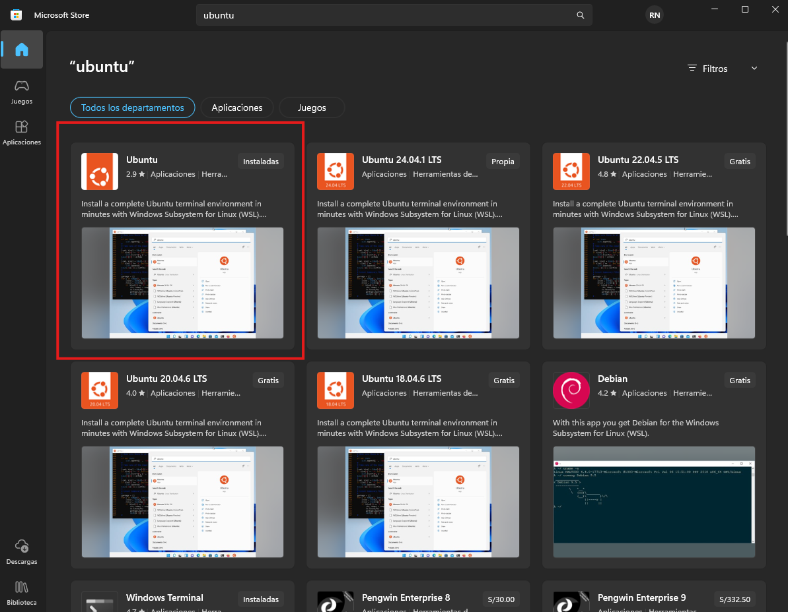

# Ambiente de Desarrollo con Terraform , Docker y Ansible

Este proyecto crea un entorno de desarrollo (DEV) usando [Terraform](https://www.terraform.io/), [Docker](https://www.docker.com/) y Ansible.  
El objetivo es que, con unos cuantos comandos, se levanten todos los servicios necesarios para probar aplicaciones en un ambiente local.
Finalmente utilizando workspaces (dev, qa, prod) reutilizamos el mismo codigo para estados separados.

---

## ¿Qué se crea con este proyecto?

Cuando lo ejecutes, tendrás funcionando lo siguiente:

- **Balanceador Nginx (proxy) con round-robin**  
  - dev → `http://localhost:5001/`  
  - qa  → `http://localhost:5002/`  
  - prod → `http://localhost:5003/`  

- **3 aplicaciones web (Nginx) detrás del proxy**  
  - Las apps (`app1`, `app2`, `app3`) **no exponen puertos al host**.  
  - El proxy reparte tráfico entre ellas dentro de la red interna.

- **Base de datos PostgreSQL**  
  - Usuario: `admin_user`  
  - Contraseña: `admin_pass`  
  - Base de datos: `app_db`

- **Base de datos en memoria Redis** (para cache)

- **Grafana** para monitoreo → [http://localhost:3000](http://localhost:3000)  

- **Redes internas** para que los contenedores puedan comunicarse entre sí:
  - `app_net` → conecta las aplicaciones con Grafana  
  - `persistence_net` → conecta Redis y Postgres con las aplicaciones  
  - `monitor_net` → conecta Grafana con el resto  

- **Volúmenes persistentes** (los datos no se borran aunque elimines los contenedores):
  - `postgres_data` → guarda la información de la base de datos  
  - `redis_data` → guarda los datos de Redis  

---
## Requisitos

Antes de empezar asegúrate de tener instalado:

1. [Docker](https://docs.docker.com/get-docker/)  
2. [Terraform](https://developer.hashicorp.com/terraform/downloads)  
3. [Ansible](https://docs.ansible.com/ansible/latest/installation_guide/intro_installation.html) si quieres renderizar la config del proxy desde `ansible/`

---

## Instalacion de ANSIBLE

- Si utilizas windows descarga de la Microsoft Store ubuntu 



  Una vez instalado eliges tu usuario y contraseña. 
  ``` bash
  sudo apt update
  sudo apt install software-properties-common
  sudo add-apt-repository --yes --update ppa:ansible/ansible
  sudo apt install ansible
  ```
---


## Cómo levantar el proyecto
En este proyecto, hemos implementado workspaces (dev, qa y prod)

1. Clona este repositorio en tu computadora:
   ```bash
   git clone https://github.com/RAgredaIpar/terraform-docker-test.git
   cd terraform-docker-test
2. Inicializa Terraform:
    ```
    cd terraform
    terraform init
3. Si ya hubieran recursos en "default", es mejor bajarlos:
    ```bash
    terraform workspace show      # respuesta -> "default"
    terraform destroy
4. Crear / seleccionar un workspace y "apply"
    ```bash
    terraform workspace new dev
    terraform workspace select dev
    terraform workspace show      # respuesta -> "dev"
5. Revisa qué se va a crear:
    ```
    terraform plan
6. Aplica los cambios
    ```
    terraform apply

7. Renderiza la configuracion de ansible
    ```
    cd ansible
    ansible-playbook -i ansible/inventory.ini ansible/playbook.yaml
## Configuración

Si quieres cambiar el puerto de Grafana (en dev = 3000), edita el archivo terraform.tfvars en el workspace que desees trabajar:

```bash
grafana_external_port = {
  dev  = 3000
  qa   = 4000
  prod = 5000
}
```

Por ejemplo, si quieres usar el puerto 3001:

```bash
grafana_external_port = {
  dev  = 3001
  ...
}
```
Lo mismo aplica para el siguiente:
```bash
nginx_proxy_external_port = {
  dev  = 5001
  qa   = 5002
  prod = 5003
}
```

## Verificacion rapida
Estado general
```bash
docker ps
```
Redis responde correctamente
```bash
docker exec redis redis-cli ping
```
Si funciona, respondera -> PONG

---
## Comprobar conexion entre contenedores

Para comprobar desde grafana
```bash
docker exec -it grafana sh
```
Una vez ingreses a la consola del contenedor de grafana ejecuta lo siguiente (En este comando puedes utilizar app1, app2 y app3):
```
curl http://app1
```

Para comprobar desde app1, app2, app3 la conexion con las bases de datos y grafana
```bash
docker exec -it app1 sh
```
- Para postgres, redis y grafana
  ```
  ping postgres
  ```
  ```
  ping redis
  ```
  ```
  ping grafana
  ```

Aparecerán los paquetes recibidos por parte de los servicios.

---
## Verificación rápida de servicios
- Estado general
```bash
docker ps
```
- Proxy (round-robin)
```bash
curl http://localhost:5001/
curl http://localhost:5001/
curl http://localhost:5001/
```
Deberías ver alternar el contenido servido por app1, app2, app3. Al inicio se repetirán